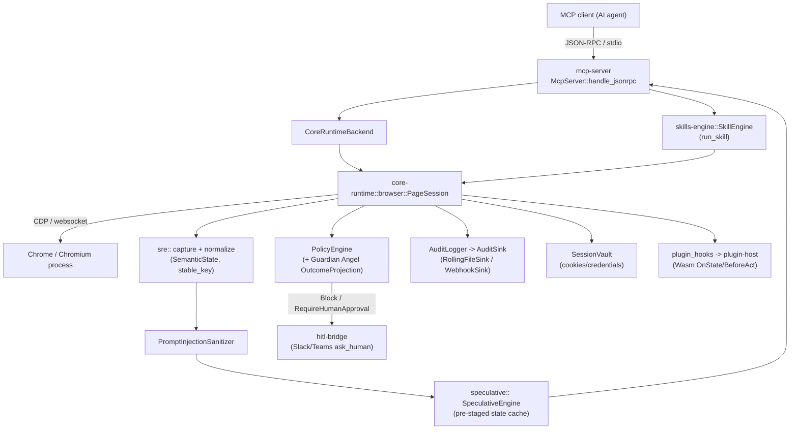

# ARCHITECTURE.md

## Overview

Dragon Head sits between an MCP client (an AI agent) and a real Chrome
process. The MCP client speaks JSON-RPC over stdio to `dragon-head-mcp`;
`dragon-head-mcp` drives Chrome over CDP and translates the live DOM into a
compact **Semantic State** the agent can reason about, instead of raw
HTML/screenshots.

## Components and responsibilities

| Component | Responsibility |
|---|---|
| `mcp-server` | stdio JSON-RPC server; tool contract (8 tools: `get_state`, `act`, `verify`, `get_visual`, `ask_human`, `run_skill`, `get_usage_report`, `extract`); config loading; `--doctor`/`--init`; usage metering and plan-tier gating |
| `core-runtime::browser` | Owns the Chrome process and per-tab `PageSession`; executes actions; crash/disconnect detection and relaunch |
| `core-runtime::sre` | DOM → `SemanticState`/`SemanticNode` capture and normalization; `stable_key` identity; delta computation |
| `core-runtime::policy` | `PolicyEngine` — rule-based action gating (Allow/Block/RequireHumanApproval) and Guardian Angel outcome projection |
| `core-runtime::audit` / `audit_sink` | Structured, PII-redacted action log; `RollingFileSink` (NDJSON) and `WebhookSink` |
| `core-runtime::privacy` | Regex-based PII detection/redaction applied to audit events |
| `core-runtime::prompt_injection` | Flags/redacts indirect prompt-injection patterns in `SemanticNode` content |
| `core-runtime::session_vault` | Encrypted storage/restoration of session cookies/credentials |
| `core-runtime::speculative` | Predicts the next action and pre-stages the resulting state for near-zero-TTFT `get_state` |
| `core-runtime::dom_signature` | Fuzzy DOM-signature fallback when `stable_key`/`target_id` lookup misses (self-healing recovery) |
| `core-runtime::plugin_hooks` | Trait boundary letting `plugin-host` plugins observe state / intercept actions |
| `skills-engine` | Parses and runs declarative `SkillDefinition` workflows (Locate/Verify/Act/Wait/Extract/Handoff steps) |
| `plugin-host` | Validates Wasm plugin manifests (signature, SBOM, capabilities) and executes them via `wasmtime` |
| `marketplace` | Plugin/domain-pack metadata and revenue-share primitives |
| `hitl-bridge` | Standalone binary: Slack/Teams webhook server resolving pending `ask_human` approvals |
| `bench` | NFR/ROI benchmarking harness producing markdown dashboards |
| `test-bench-support` | Shared `should_skip_browser_tests()` helper for Chrome-dependent tests |

## Dependency direction

`mcp-server` depends on `core-runtime`, `skills-engine`, and `plugin-host`.
`core-runtime` has no dependency on the other workspace crates — it's the
foundation. `hitl-bridge`, `bench`, and `marketplace` are independent
binaries/libraries that don't feed back into `core-runtime`. There is no
cyclic dependency between workspace crates.

## Data flow: `get_state`

1. Return the cached `SemanticState` if present and `force_refresh` isn't set.
2. `resolve_speculative_state`: ask `SpeculativeEngine` for a pre-staged
   prediction (`pre_generate`/`predict`).
3. **Hit** → serve the cached state directly (near-zero TTFT), mark it
   unverified (`previous_state_verified = false`).
4. **Miss** → `PageSession::capture_semantic_state(LoadProfile)` → sanitize
   with `PromptInjectionSanitizer` → feed the observation back into
   `SpeculativeEngine::observe_state`/`record_transition` → build response.
5. For delta requests: `current.select_update(previous, DeltaPolicy)` produces
   `StateUpdate::{Noop, Full, Delta}` (an RFC 6902 JSON Patch for `Delta`).

`PolicyEngine` is **not** consulted on `get_state` — only `act` goes through
policy.

## Data flow: `act`

1. If an unverified speculative hit is pending, verify it with a real capture
   before mutating the page.
2. `AuditEvent::ToolCall` is logged **before** policy enforcement or
   execution — audit always sees the attempt, even if it's later blocked.
3. `PolicyEngine::enforce_policy` runs next; it can short-circuit with
   `ActionError::Blocked`, `HumanApprovalRequired` (escalates to `hitl-bridge`
   via `ask_human`), or `VerifyRequired`, all before any CDP mutation.
4. The CDP action executes against the resolved element. If `target_id`
   lookup fails, it falls back to `stable_key`, then to
   `dom_signature`'s fuzzy self-healing match — re-running policy enforcement
   on whatever node is recovered.
5. On success, the state cache is invalidated and the executed action is
   recorded for the speculative engine's transition model.

## State management

- **Per-session state** lives inside `PageSession` (policy engine instance,
  stable-key index, DOM-signature cache, speculative engine, state cache) —
  not global; each `new_page`/`new_page_with_audit_logger` call creates fresh
  state, sharing only the `SessionVault` and plugin hooks from the parent
  `BrowserClient`.
- **No external database.** All state is in-process or on local disk (audit
  log files, session vault).
- **Crash recovery**: `BrowserClient::relaunch` restarts the Chrome process
  with the same config and rebuilds a `PageSession`; `is_browser_disconnected`
  detects CDP websocket/IO disconnect errors to trigger this path.

## External services / IO boundaries

| Boundary | Mechanism | File |
|---|---|---|
| Chrome/Chromium | CDP over websocket (`headless_chrome` crate) | `core-runtime/src/browser.rs` |
| Audit log files | NDJSON, rotated by size | `core-runtime/src/audit_sink.rs` (`RollingFileSink`) |
| Audit webhook | HTTP POST per event | `core-runtime/src/audit_sink.rs` (`WebhookSink`) |
| Slack/Teams HITL | Inbound HTTP webhook, HMAC-verified | `hitl-bridge/src/server.rs` |
| Config file | `$XDG_CONFIG_HOME/dragon-head/config.toml` | `mcp-server/src/config.rs` |
| Session credentials | Local encrypted vault | `core-runtime/src/session_vault.rs` |
| Wasm plugins | `wasmtime` sandboxed execution | `plugin-host/src/lib.rs` |

## Key design decisions

- **Semantic State, not DOM.** Decouples agent reasoning from page markup
  churn; `stable_key` (content hash + collision index) gives elements
  identity across re-renders without relying on fragile DOM paths.
- **Speculative pre-generation is additive, not load-bearing.** It *fronts*
  the normal async capture pipeline rather than replacing it — a miss always
  falls back to a real, correct capture (`StateDelta::Mismatch`).
- **Policy decisions carry an `OutcomeProjection`** (Guardian Angel) so a
  human approving an action sees the projected monetary/risk impact, not just
  "approve this action?".
- **Audit-before-policy-before-execution** ordering is deliberate: even a
  blocked action attempt is auditable.
- **Plugins and skills are declarative/sandboxed**, not arbitrary code in the
  hot path — `plugin-host` runs Wasm under `wasmtime` with capability gating
  (`ReadState`/`NetworkOut`/`VaultAccess`); `skills-engine` runs a fixed step
  vocabulary (Locate/Verify/Act/Wait/Extract/Handoff), not a scripting
  language.

## Easy to extend

- New policy rule shapes / outcome projectors (`core-runtime/src/policy.rs`)
  — additive structs with `#[serde(default)]` fields.
- New skill step types (`skills-engine`) — `SkillStep` is a closed enum but
  designed to be extended; existing tests (`skill_conformance.rs`,
  `skill_schema_compatibility.rs`) define the compatibility contract.
- New audit sinks (`core-runtime/src/audit_sink.rs`) — implement the sink
  trait alongside `RollingFileSink`/`WebhookSink`.
- New MCP tools — register in `mcp-server/src/lib.rs`'s tool list + dispatch
  match; contract tests in `mcp-server/tests/mcp_protocol_compliance.rs` and
  `mcp_client_contract.rs` will need matching fixtures.

## Easy to break

- `stable_key` generation (`core-runtime/src/sre/stable_key.rs`) — any change
  changes element identity for every existing agent integration.
- The audit-before-policy-before-execution ordering in `browser.rs::act` — a
  refactor that reorders these silently weakens the audit guarantee.
- `SpeculativeEngine` cache invalidation — a stale-but-served prediction
  means an agent acts on data that no longer matches the page.
- Nextest profile inheritance (`.config/nextest.toml`) — `[profile.ci]` does
  not inherit `[profile.default]`; a field added only to one silently
  reverts to nextest's built-in default in the other.
